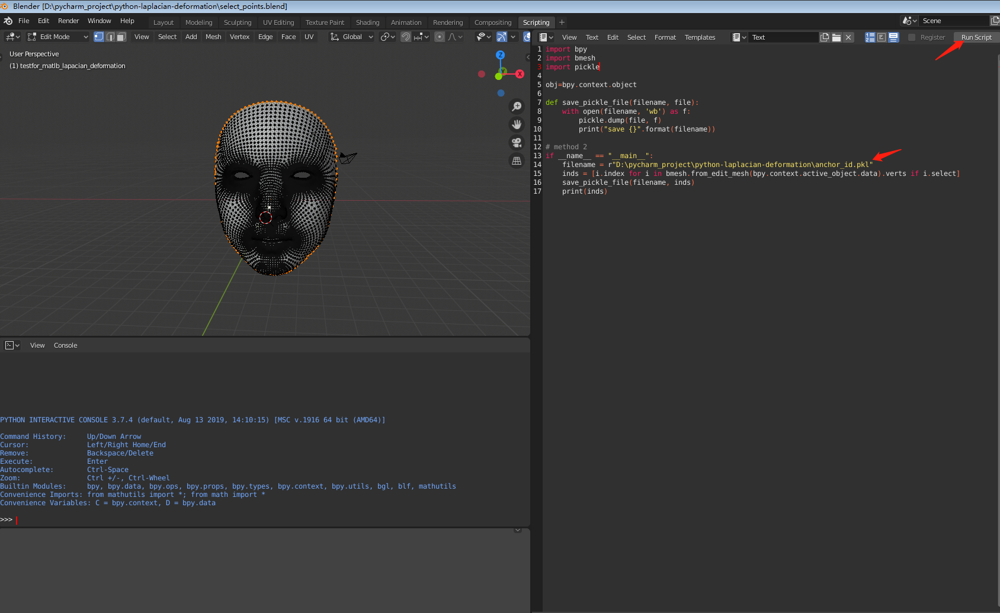

# python-laplacian-deformation
a python version of laplacian deformation based on https://github.com/bmershon/laplacian-meshes  
### step1 select anchors using blender
open select_points.blend  

0 import your mesh
1 select your points in edit mode  
2 modify the filename in the script  
3 click run script  
(PS: the index starts from 0)

### step 2 run python demo.py

### the demo result

origin image

demo deformation result

